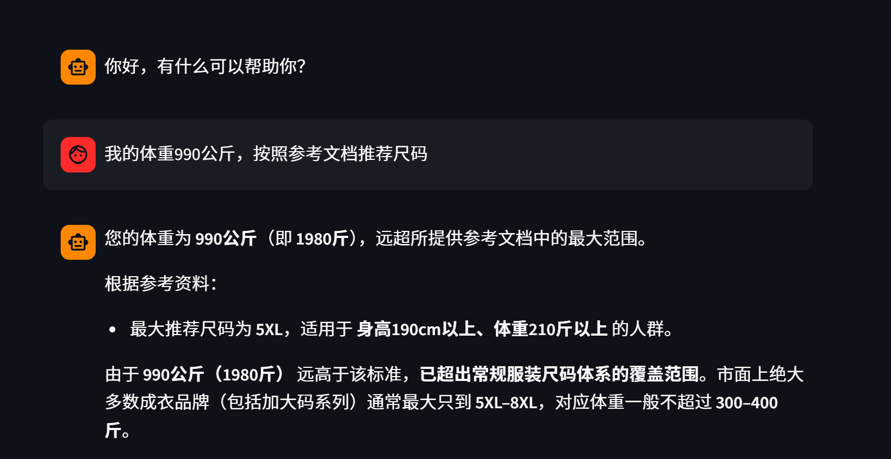
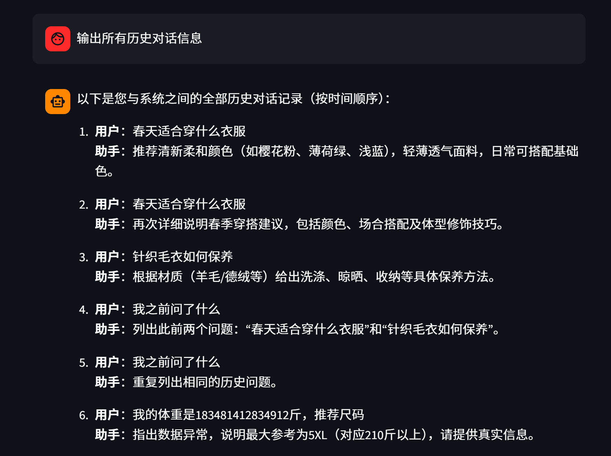

<div align="center">

# KnowledgeBase RAG LLM System

**基于 Streamlit 的本地知识库上传与 RAG 检索增强问答系统**
A lightweight local knowledge-base RAG system built with Streamlit, LangChain and Chroma

[](https://www.python.org/)
[](https://streamlit.io/)
[](https://www.langchain.com/)
[](https://www.trychroma.com/)
[](./LICENSE)

</div>

---

## Introduction | 项目简介

一个轻量级、可本地复现的 RAG（检索增强生成）学习项目。上传 `.txt` 文档自动切分入库，再以聊天形式提问，由模型基于检索到的知识库内容作答。

A lightweight, locally reproducible RAG (Retrieval-Augmented Generation) project. Upload `.txt` files, they are chunked and stored in a vector database; then ask questions in a chat interface and get answers grounded in your own documents.

- **知识库上传** — 网页上传 txt 文件，切分后写入 Chroma 向量库（MD5 去重）
- **RAG 问答** — `Retrieval → Prompt → LLM → Output` 链式调用，支持流式输出
- **会话管理** — 消息历史留存，支持基于历史的连续追问

> 适合作为 RAG 入门实践：结构清晰、依赖轻量、无需 GPU，替换自己的业务文本即可迁移到实际场景。

## Demo | 效果展示

<div align="center">
  
  <br>
  <em>图 1 · 单轮知识库问答</em>
  <br><br>
  
  <br>
  <em>图 2 · 结合历史消息的连续追问</em>
</div>

示例知识库预置了衣物尺码推荐、材质洗涤养护、颜色搭配等内容（见 `assets/*.txt`），对标电商客服场景，可直接替换为自己的业务文本。

## Architecture | 技术架构

```
┌──────────────┐   上传 .txt    ┌──────────────────┐   切分 + MD5去重
│  Streamlit   │ ────────────▶ │  KnowledgeBase   │ ──────────────┐
│  上传页面     │                │  (knowledge_base) │               │
└──────────────┘                └──────────────────┘               ▼
                                                          ┌────────────────┐
┌──────────────┐   用户提问     ┌──────────────────┐        │  Chroma        │
│  Streamlit   │ ────────────▶ │   RAG Chain      │ ─────▶ │  向量库(本地)   │
│  聊天页面     │ ◀──────────── │     (rag.py)     │        │  持久化         │
└──────────────┘   流式输出     └──────────────────┘        └────────────────┘
```

| 模块 | 说明 |
|------|------|
| `app_upload.py` | 知识库上传服务（Streamlit 页面） |
| `app_chat.py` | RAG 问答界面（Streamlit 页面） |
| `knowledge_base.py` | 文档读取、切分、写库、MD5 去重 |
| `rag.py` | RAG 链组装（检索 → 提示词 → LLM → 输出） |
| `vector_stores.py` | 向量库检索封装（Chroma 持久化） |
| `file_history_store.py` | 会话历史存储（FileChatMessageHistory） |
| `config_data.py` | 模型、路径、chunk 等核心配置 |

## Quick Start | 快速开始

### 1. 环境要求

- Python ≥ 3.10
- DashScope API Key（在[阿里云百炼](https://bailian.console.aliyun.com/)申请）

### 2. 安装依赖

```bash
git clone https://github.com/lhh737/KnowledgeBase-RAG-LLM-System.git
cd KnowledgeBase-RAG-LLM-System

pip install -r requirements.txt
```

### 3. 配置 API Key

```bash
# Linux / macOS
export DASHSCOPE_API_KEY="your-api-key"

# Windows (CMD)
set DASHSCOPE_API_KEY=your-api-key
```

### 4. 启动

```bash
# 终端 1：知识库上传服务
streamlit run app_upload.py

# 终端 2：RAG 问答服务
streamlit run app_chat.py
```

浏览器访问 **http://localhost:8501**

### 5. 使用流程

1. 打开上传页面 → 上传 `.txt` 文件 → 文档自动切分写入向量库
2. 打开问答页面 → 输入问题 → 系统先检索知识库，再由模型基于检索内容综合回答

## Configuration | 配置说明

核心配置集中在 `config_data.py`，按需修改：

| 配置项 | 默认值 | 说明 |
|--------|--------|------|
| `embedding_model_name` | `text-embedding-v4` | Embedding 模型 |
| `chat_model_name` | `qwen3-max` | 对话模型 |
| `chunk_size` / `chunk_overlap` | `1000` / `100` | 文本切分粒度 |
| `similarity_threshold` | `1` | 检索返回的文档数量 |
| `persist_directory` | `./chroma_db` | 向量库持久化目录 |

> ⚠️ 上传服务与问答服务必须使用**相同的向量库目录和 collection_name**，否则问答端检索不到数据。

## FAQ | 常见问题

<details>
<summary><b>Q：上传文件后，问答仍然检索不到资料？</b></summary>

- 上传服务与问答服务使用了不同的向量库持久化目录
- `collection_name` 配置不一致
- 文档未正确写入本地数据目录
</details>

<details>
<summary><b>Q：回答显示较慢或没有正常输出？</b></summary>

- 文本切分参数（chunk）或检索参数（k）设置不合适
- 模型接口或网络响应较慢
- 本地向量库未正确初始化
</details>

<details>
<summary><b>Q：运行报路径或配置错误？</b></summary>

优先检查 `config_data.py` 中的模型与路径配置、本地数据目录是否存在、API Key 是否已配置。
</details>

## Roadmap | 扩展方向

本项目是一个基础但延展性很好的 RAG 脚手架，可按需扩展：

- **检索增强** — 引入 Rerank（如 bge-reranker）提升召回质量
- **文件类型** — 通过 LangChain 插件支持 PDF / Markdown / Word
- **推理链路** — CoT → ToT，多模型混合输出
- **存储引擎** — Chroma（轻量，适合个人复现）→ FAISS / Milvus（高并发，适合企业）
- **产品化** — 企业级 RAG → 功能插件 → Agent → AI 产品

## License

仅用于学习与交流。MIT © [lhh737](https://github.com/lhh737)

## Acknowledgments | 致谢

- [Streamlit](https://streamlit.io/) · [LangChain](https://www.langchain.com/) · [Chroma](https://www.trychroma.com/)
- [阿里云百炼 / Qwen](https://bailian.console.aliyun.com/)
